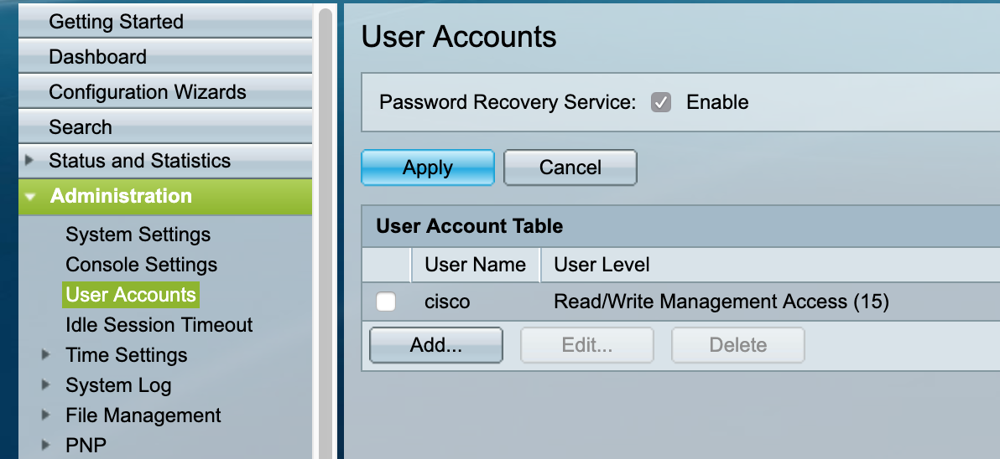
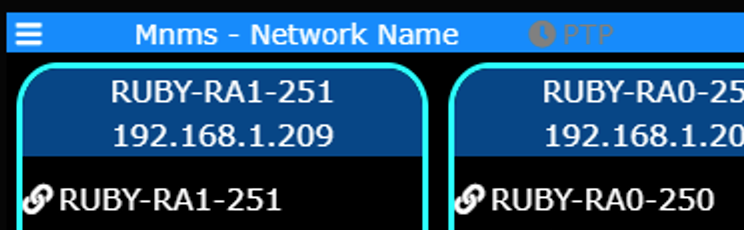
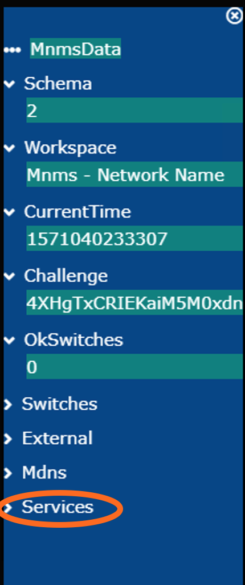
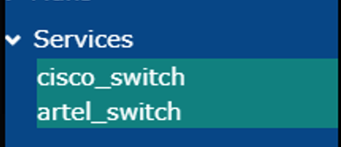
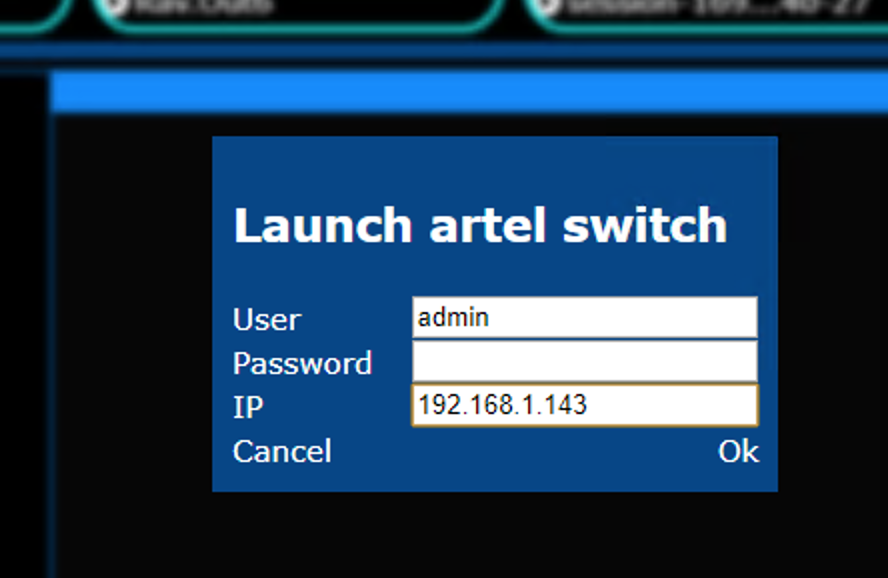
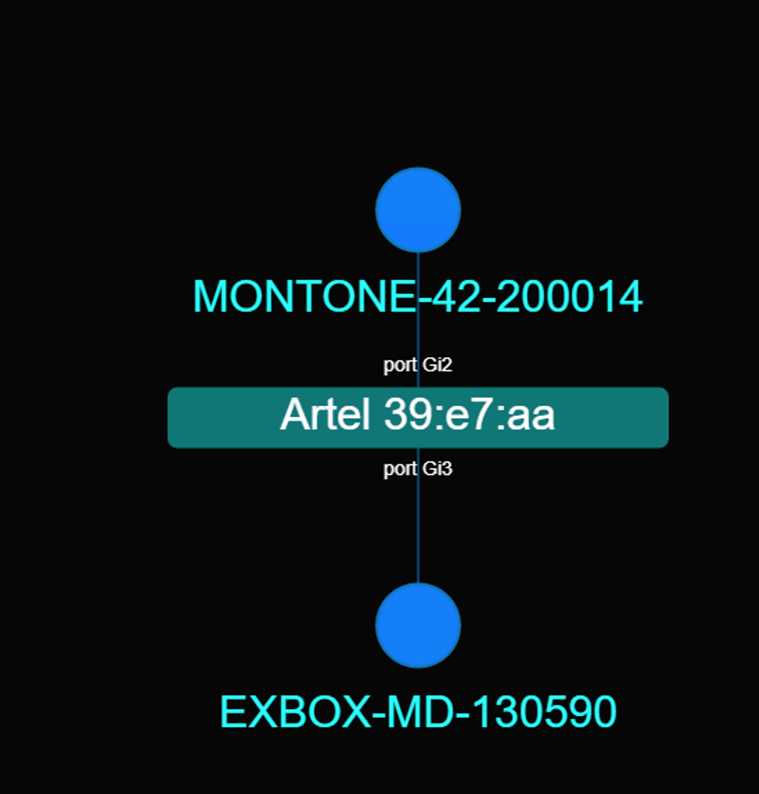

# Latest news

25th Sept: Fixed a bug preventing connection to cisco switch.... if you tried and were unhappy, test latest version  

14th Oct: Artel switch supported in desktop app, settings menu and daily app build !

# media-network-manager-cloud

**Also has the cool name of : MnMs (Media Network M{onitoring,anagement} S{ystem,ervices})**

Set of tools for multiplatform real time media network (ST2110, AES67, Dante... ) monitoring and administration
This is aimed a being a swarm of microservices all connected to a mission control app or website. 

It is work in progress. At the moment it:
* Shows the topology of the network
* Gives information on switch ports: what is it connected to, bandwith, multicast group registration..
* Shows the different MDNS services and, if there, shows SDP information and if it is AES67, ST-2022-7 
* Traces the groups registration on the network (light the network path where the group has been registered)

You can find an aggregated/app form of the tools here (nightly build):  

[Linux](https://mnms.sturmel.com/latest-linux) 

[MacOS](https://mnms.sturmel.com/latest-darwin)   (copy the app in /Applications folder)

[Windws](https://mnms.sturmel.com/latest-win32) 

You would have to accept some security warnings to launch the app. Or you can take the whole repository and build-it yourself.

## Prerequisite

At the moment, the software only works with SG3XX cisco switches. Be my guest (or contact me) if you want other switches support. You can have any number of switches on the network, the software should resolver inter-switch connection.

## First run

You have to tell the system to connect to the switches, click on the switch text in the bottom right and a list should appear if your switches have MDNS and TELNET activated.

## Limitations

The SG3XX switches MUST have mdns, telnet access enabled and the cisco/cisco user. You will be able to change this in the future.

Only does MDNS query on the default interface, does not yet give you the choice of it

The app will create a webserver running on port 8888, you can then access the UI from other devices on the network

Right now... this is only data mining and shaping

## Launching switches by hand (Artel, Cisco... custom user/pwd)

Open the left menu

Click on services

Choose the switch you want

Enter data

Here it should be there

## Components

You have to run npm i in every subfolder

### mission control

The user ui, builds a MDNS directory

### cisco switch

SG3XX data mining via telnet

### mdns-browser

Service doing MDNS query and data shaping for mission control

###  mnms-client-ws-interface

Web socket client module to connect to mission control

### rtsp-sdp-query

Does simple query to get SDP from RRTSP

### MnMs-desktop

The electron app builder, firt run npm cloud-copy before npm package-<system>

## About the poject owner

I am Nicolas Sturmel, technical product manager and developer at Merging Technology, focusing on Media Network implmentations (test, validation, tools for users and installers). 

This project is not linked with Merging, any question or comment will be handled by me on a best effort basis.

## Licence

MIT, do what you want with the code.
If you are looking for a custom solution, you can contact me !

