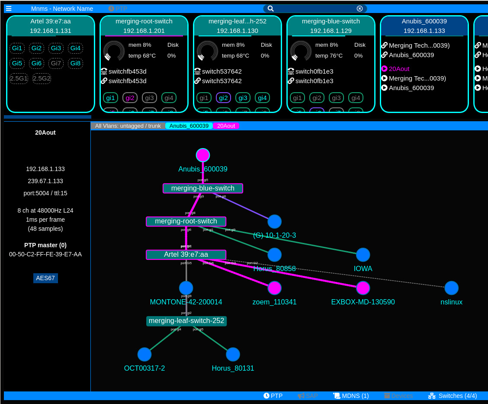

# Latest news

Summer 2020: Added VLAN monitoring and devices guessing using switches ARP table etc..

Spring 2020: Added UI to give system stat (memory, cpu, temp), ovrall better UX.

Oct 2019: Artel switch supported in desktop app, settings menu and daily app build !

Sept 2019: Fixed a bug preventing connection to cisco switch.... if you tried and were unhappy, test latest version

# Detailed manuals

[UI manual](UI-MANUAL.md)

[Architecture](ARCHITECTURE.md)

[Advanced use](ADVANCED.md)

## Switch Support

| Manufacturer | Range, protocol | MacAddress table, stats | Multicast groups | VLANs | System | Arp table |
| - | - | - | - | - | - | - |
| Cisco | SG3XX-SG5XX (via telnet) | y | y | y | y | y |
| Artel | Quara (json-rpc) | y | y | to do | to do | no |
| SNMP | ?? | y | no | y | to do | no (to do ?) |
| Arista | EOS eAPI | to do | to do | to do | to do | to do |

# media-network-manager-cloud

**Also has the cool name of : MnMs (Media Network M{onitoring,anagement} S{ystem,ervices})**

Set of tools for multiplatform real time media network (ST2110, AES67, Dante... ) monitoring and administration
This is aimed a being a swarm of microservices all connected to a mission control app or website. 

It is work in progress. At the moment it:
* Shows the topology of the network
* Shows the different VLANs using colors
* Gives information on switch ports: what is it connected to, bandwith, VLAN, multicast group registration..
* Shows the different MDNS services and, if there, shows SDP information and if it is AES67, ST-2022-7 
* Traces the groups registration on the network (light the network path where the group has been registered)

You can find an aggregated/app form of the tools here (nightly build):  

[Linux](https://mnms.sturmel.com/latest-linux) 

[MacOS](https://mnms.sturmel.com/latest-darwin)   (copy the app in /Applications folder)

[Windws](https://mnms.sturmel.com/latest-win32) 

You would have to accept some security warnings to launch the app. Or you can take the whole repository and build-it yourself.



## Prerequisite

At the moment, the software only works with SG3XX cisco switches or Artel Quarra switches. Be my guest (or contact me) if you want other switches support. You can have any number of switches on the network, the software should resolver inter-switch connection.

## Cisco switch: First run (easy path)

You have to tell the system to connect to the switches, click on the switch text in the bottom right and a list should appear if your switches have MDNS and TELNET activated.


Or you can launch the services by hand ! (still need telnet on cisco)


## Launching switches by hand (Artel, Cisco, SNMP... custom user/pwd)

Open the left menu


Click on services


Choose the switch you want


Enter data


Here it should be there


## Limitations

The SG3XX switches MUST have telnet access enabled, mDNS/Bonjour is always better.


Does MDNS query on the default interface, does not yet give you the choice of it

The app will create a webserver running on port 8888, you can then access the UI from other devices on the network

Right now... this is only data mining and shaping

### Installig from github

Run the script "install.sh" to pull all the dependencies in every directory, then   ```node main``` in the mission-control sub dir.

## Components

More info in the architecture page.

### Arhitecure

The central point of the system is the "mission control", it manages other services based on what is discovered and configured.

### mission control

The user ui, builds a MDNS directory

### cisco switch

SG3XX data mining via telnet

### mdns-browser

Service doing MDNS query and data shaping for mission control

###  mnms-client-ws-interface

Web socket client module to connect to mission control

### rtsp-sdp-query

Does simple query to get SDP from RRTSP

### MnMs-desktop

The electron app builder, firt run npm cloud-copy before npm package-<system>

## Debug, custom UI

A smal rest API
localhost:8888/noodes gives you the full inner data
you can even use key/value pairs to filter the data
localhost:8888/nodes?Type=switch will only give you the switches 

## About the poject owner

I am Nicolas Sturmel, technical product manager and developer at Merging Technology, focusing on Media Network implmentations (test, validation, tools for users and installers). 

This project is not linked with Merging, any question or comment will be handled by me on a best effort basis.

## Licence

MIT, do what you want with the code.
If you are looking for a custom solution, you can contact me !

