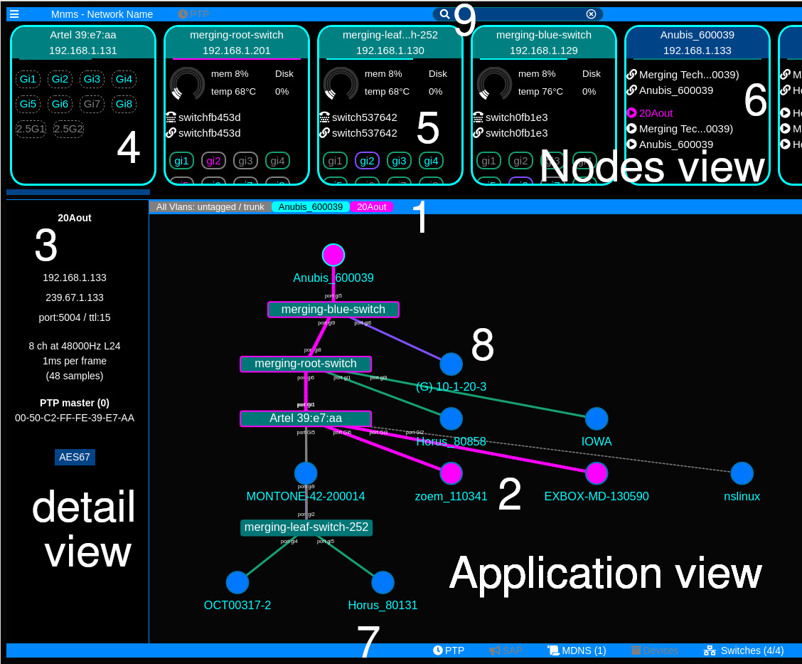

# MNMS UI manual

## MNMS interface



1. The selection bars indicates that we selected all VLAN, node Anubis_600039 and session 20Aout
2. We see on the application view that this session multicast is routed to two nodes connected to Artel 39:c7:aa
3. We see the session detail on the detail view
4. We have switch node with no service, we see interface Gi7, 2.5G1 and 2.5G2 are not pluged in
5. On this cisco switch we see system infos and services (telnet and http)
6. This node is a regular node that has 2 http services and 3 rtsp services
7. The status bar shows that we have MDNS active on one interface, and 4 switch services currently active
8. This node has a different color lin, it is on a different VLAN. It name is prefixed by (G) because MNMS only discovered it through Mac address and Arp tables
9. The serach window allows to search a specific node by name or IP

## Special nodes

Nodes prefixed by (G) are ghost nodes, MNMS detected they should be there but did not discover them. Reasons:
- The node is offline
- The node does not respond to MDNS
- The node is in a different VLAN

Nodes prefixed with (S) are static nodes that have not yet been merged, see [advanced use](ADVANCED.md) for more info.

## Node interface color code

A node interface is light blue when connected, gray when disconnected and light pink when turned off (inatice even when plugged)

The border of the interface name is:
- The VLAN color when this VLAN is selected or All Vlans is selected and this VLAN is untagged
- light gray when a trunck port (all vlans selected)
- dashed Vlan color when a this VLAN is selected and tagged on the interface
- dashed Gray when unknown

It will be full red (border and text) when bandwidth exceeds 50%

## The nodes view

The top section of the MNMS view is for quick display of all node on the network. MNMS will give synthtic infos on the nodes: discovered MDNS services, switch interfaces, system status. Go to the detailed view section for more info.

Nodes are organized automaticaly in order of priority:
- First are problematic switches (errors or detected bitrate above threshold)
- Then regular switches
- Then regular nodes
There is a automatic score computed based on the number of interface, their status, the number of services. This means that when changing your network (pluging, unpluging, addid/removing section) the order my vary. This also means that a regular node with a lot of sessions may be placed before a lightly populated switch.

## The detail view

This view displays details on the selected node or node item (e.g.: streaming session)

*When displaying a node* it shows its IPs, system status (CPU, memory, temperature), interfaces if it is a switch, and services discovered with DNS-SD on the node:
- (link icon) http services --> clicking on it will open the link in an other page
- (telephone icon) telnet services
- () rtsp services and sessions --> clicking on it will open the detalled with for this streaming session
- () dante services --> clicking on it will open the Dante device detailed view, still beta

*The network interfaces* show incoming (I), outgoing (O) traffic in MBits/s as well as the number of multicast groups registered for this interfaces. If ```all``` is displayed, this means that the port is a router port.

**limitations**: user can not yet click on interface for a detailed view (Macs, IP, node connected, list of multicast groups etc...)


## The selection bar

The simple bar on top of the application shows the current selection, including the parent of the selection when applicable.

It also allows selection of the current VLAN to inspect, this will impact the other views in the information they show.

When choosing untagged / tagged, all VLAN will show with their color when untagged on a switch port to a node. If a specific VLAN number is chosen, on this VLAN color will be chosen and tagged or untagged connections may be displayed seprately.

## The application view

The application view is the main part of MNMS

### Network topology

This is the main network views, with all the nodes that MNMS is capable to interconnect. It does interact directly with the selection bar and the detail view. 

*The nodes placement* is automatic and the view will zoom to fit the whole network when it is updated.

*VLANs*: Trunk VLAN are displayed in gray, untagged VLAN using a solid line and taged VLAN (when specific VLANs are chosen) are shown using a dashed line.

*Multicast*: When a multicast streaming session or a multicast group is selected, the will highlight all the interconnexion where the multicast is suposed to be routed. Switches and routers routing the group(s) as well as nodes where the group(s) are supposed to be sent to will be highlighted as well.

*2022-7 streaming*: Different colors are used for the first and second streams of a 2022-7 session.

### Other views

Other views such as: logs, scheduler, or RTP or PTP analysis should appear in the future

## The bottom status line

This line is aimed at giving feedback on the services running on MNMS. Namely, the number of switches MNMS is datamining infos from, and the presence of the PTP analysis service or not. It shall improve over time.

## The left menu

The left menu is dedicated to advanced usages and has the following sections. **Beware, the menu does not update automatically, you have to close and reopen the menu to update the information.**

### Administration section

The following left menu items are for administrative purpose:

### Debug section

The following left menu items are for debugging purpose:

### Sections to add a service

The following left menu items are dedicated to adding services to your MNMS cloud:

### The nodes view

This section allows you to browse MNMS internal data mined from the network directly. It is helpul for debugging puprpose or just out of curiosity.
